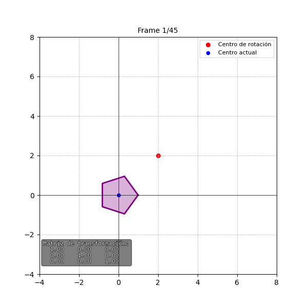

# 🎨 Taller: Transformaciones Geométricas Visuales

## 🔍 Objetivo del taller

Explorar los conceptos fundamentales de transformaciones geométricas como traslación, rotación y escala en distintos entornos de programación visual.  
Cada estudiante debe crear un **"Hola Mundo Visual"** donde se aplique una combinación de transformaciones **estáticas y animadas** sobre un objeto o escena básica.

---

## 🔧 Entornos utilizados

El ejercicio fue desarrollado en los siguientes entornos:

- Python (con Matplotlib y Numpy)
- Processing (3D en Java)
- Three.js (con React y React Three Fiber)

---

## 🐍 Python

### ✨ Descripción

- Se genera un pentágono regular centrado en el origen.
- Se le aplican transformaciones animadas: rotación, escala y traslación compuesta.
- Se visualiza la trayectoria del centro del pentágono a lo largo del tiempo.
- Se exporta la animación como un GIF.

### 📷 GIF



### 🧠 Características importantes

- Uso de coordenadas homogéneas para aplicar transformaciones.
- La transformación compuesta incluye traslación al origen, escalado, rotación y regreso.
- Se visualiza la matriz de transformación en cada frame.

### 🧩 Código relevante

```python
# Crear un pentagono regular
def crear_pentagono(radio=1):
    angulos = np.linspace(0, 2 * np.pi, 6)[:-1]
    x = radio * np.cos(angulos)
    y = radio * np.sin(angulos)
    x = np.append(x, x[0])
    y = np.append(y, y[0])
    return np.vstack((x, y))

# Matrices de transformación
def matriz_traslacion(tx, ty):
    return np.array([[1, 0, tx], [0, 1, ty], [0, 0, 1]])

def matriz_rotacion(theta):
    c, s = np.cos(theta), np.sin(theta)
    return np.array([[c, -s, 0], [s, c, 0], [0, 0, 1]])

def matriz_escala(sx, sy):
    return np.array([[sx, 0, 0], [0, sy, 0], [0, 0, 1]])
```

## ⚙️ Processing

### ✨ Descripción

- Se dibuja un toroide 3D que se traslada cíclicamente a lo largo de los vértices de un triángulo equilátero.
- Animaciones de rotación continua y escalado dinámico.
- La trayectoria del movimiento se traza visualmente en la escena.

### 📷 Captura

### 🧠 Características importantes

- Interpolación de movimiento entre vértices usando PVector.lerp.
- Transformaciones aplicadas dentro del pushMatrix y popMatrix.
- Representación visual del trayecto triangular y vértices con esferas.

### 🧩 Código relevante

```java
void draw() {
  background(0);
  lights();

  float t = frameCount % duracion;
  float prog = t / duracion;

  int i = floor(prog * 3);
  int j = (i + 1) % 3;
  float localT = (prog * 3) % 1;
  PVector pos = PVector.lerp(vertices[i], vertices[j], localT);

  pushMatrix();
  translate(width / 2 + pos.x, height / 2 + pos.y, pos.z);
  rotateY(frameCount * 0.01f);
  float escala = 1 + 0.5f * sin(TWO_PI * prog);
  scale(escala);
  drawRing(50, 15, color(200, 100, 255));
  popMatrix();
}
```

## 🧊 Three.js + React (React Three Fiber)

### ✨ Descripción

- Se renderiza un cubo en 3D animado con React Three Fiber.
- El cubo se traslada de manera circular, rota en dos ejes y cambia de tamaño dinámicamente.
- Se incluye grilla, ejes y control de cámara interactiva con el mouse (OrbitControls).

### 📷 Captura

### 🧠 Características importantes

- Uso de useFrame para animar en tiempo real.
- ref para manipular directamente la malla del cubo.
- Animaciones combinadas de posición, rotación y escala basadas en funciones trigonométricas.

### 🧩 Código relevante

```javascript
useFrame(({ clock }) => {
  const t = clock.getElapsedTime();
  meshRef.current.position.x = Math.sin(t) * 2;
  meshRef.current.position.z = Math.cos(t) * 2;
  meshRef.current.rotation.y += 0.02;
  meshRef.current.rotation.x += 0.01;
  const scale = 1 + 0.3 * Math.sin(t * 2);
  meshRef.current.scale.set(scale, scale, scale);
});
```