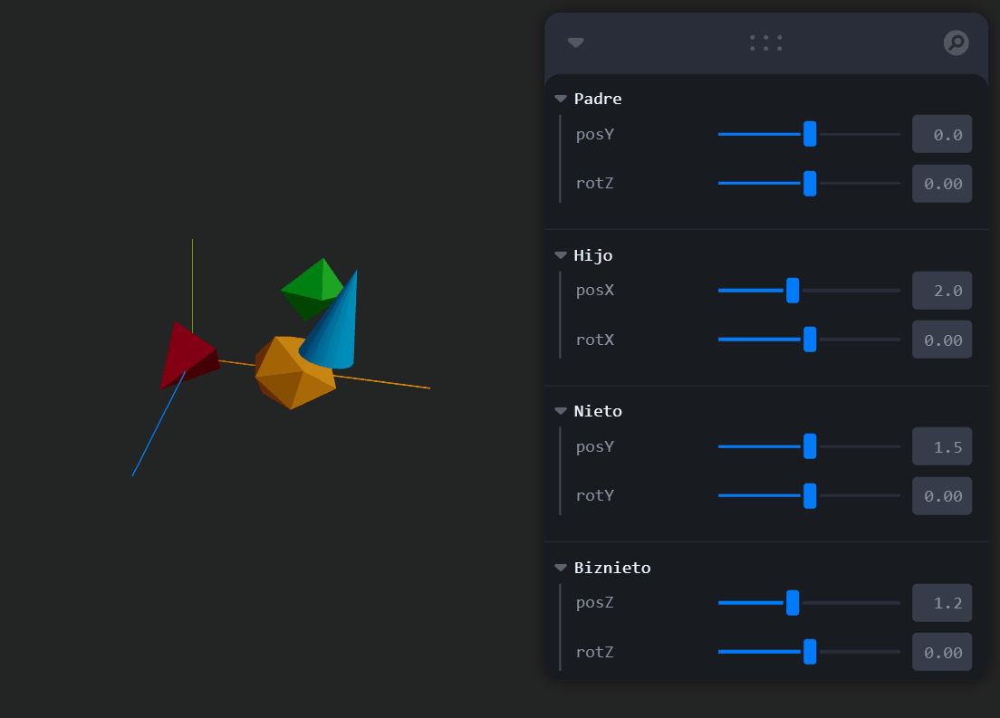

# 🧪 Taller - Jerarquías y Transformaciones: El Árbol del Movimiento

**Construyendo el Mundo 3D: Vértices, Aristas y Caras**

## 📅 Fecha
2025-05-03

---

## 🎯 Objetivo del Taller

Aplicar estructuras jerárquicas y árboles de transformación para organizar escenas y simular movimiento relativo entre objetos. Se busca comprender cómo las transformaciones afectan a los nodos hijos en una estructura padre-hijo y cómo visualizar estos efectos en tiempo real.

---

## 🧠 Conceptos Aprendidos

- Uso de grupos y jerarquía padre-hijo-nieto en escenas 3D.
- Aplicación de transformaciones (traslación y rotación) encadenadas.
- Renderizado interactivo en tiempo real con React Three Fiber.
- Control dinámico de transformaciones usando Leva.
- Observación del efecto de la transformación en cada nivel de la jerarquía.

---

## 🔧 Herramientas y Entornos

- React Three Fiber (Three.js + React)
- Vite
- drei (OrbitControls)
- leva (sliders de control en tiempo real)
---

## 📁 Estructura del Proyecto

```
2025-05-03_taller_jerarquias_transformaciones/
├── threejs    #Implementación del taller
├── resultados #Gif animados
```
---

## 🧪 Implementación

### 🔹 Etapas realizadas
1. Creación del proyecto base con Vite y React Three Fiber.
2. Definición de una jerarquía de objetos 3D usando group.
3. Implementación de transformaciones para cada nivel: padre, hijo, nieto, biznieto.
4. Integración de sliders con Leva para manipular posición y rotación de cada grupo.
5. Visualización del comportamiento relativo al modificar un nodo superior.

### 🔹 Código relevante

**🌐 App.jsx – Lienzo principal**

Este código define un componente App en React que renderiza un lienzo 3D interactivo utilizando @react-three/fiber. Configura cámara, luces, controles orbitales y una escena 3D para crear una visualización interactiva en aplicaciones web.

```python
import { Canvas } from '@react-three/fiber'
import { OrbitControls } from '@react-three/drei'
import Scene from './Scene'

export default function App() {
  return (
    // Lienzo 3D principal con cámara y luces
    <Canvas camera={{ position: [7, 5, 10], fov: 60 }}>
      <ambientLight intensity={0.4} /> {/* Luz ambiental suave */}
      <directionalLight position={[5, 10, 5]} intensity={1.2} /> {/* Luz direccional */}
      <axesHelper args={[5]} /> {/* Ejes de referencia */}
      <OrbitControls /> {/* Control de órbita con el mouse */}
      <Scene /> {/* Escena con jerarquía */}
    </Canvas>
  )
}
```

**🌐 Scene.jsx – Transformaciones jerárquicas**

El código usa useFrame para actualizar dinámicamente las posiciones y rotaciones de elementos jerárquicos en una escena 3D, basándose en referencias y propiedades externas.

```javascript
  useFrame(() => {
    if (parentRef.current) {
      parentRef.current.position.y = parent.posY
      parentRef.current.rotation.z = parent.rotZ
    }
    if (childRef.current) {
      childRef.current.position.x = child.posX
      childRef.current.rotation.x = child.rotX
    }
    if (grandChildRef.current) {
      grandChildRef.current.position.y = grandchild.posY
      grandChildRef.current.rotation.y = grandchild.rotY
    }
    if (greatGrandChildRef.current) {
      greatGrandChildRef.current.position.z = greatGrandchild.posZ
      greatGrandChildRef.current.rotation.z = greatGrandchild.rotZ
    }
  })
```
## 📊 Resultados Visuales
🎥 Interacción con sliders de Leva

Al modificar los sliders correspondientes a cada nivel de jerarquía, se puede observar cómo los objetos hijos responden en tiempo real a los cambios de sus nodos padres. Esto ilustra de forma clara cómo funcionan las transformaciones encadenadas en 3D.

🧱 Representación de cada nivel

- 🔺 Padre (tetraedro rojo)
- 🔶 Hijo (icosaedro naranja)
- 🟢 Nieto (octaedro verde)
- 🔵 Biznieto (cono azul)



---

## 🧩 Prompts Usados

```text
"Ayúdame a crear una escena con jerarquías de objetos en React Three Fiber, controlando las transformaciones con leva y mostrando cómo afectan a los hijos."
```

---

## 💬 Reflexión Final

Este taller me permitió entender de forma tangible cómo funcionan las jerarquías en gráficos 3D. El uso de Leva facilitó la exploración dinámica de transformaciones, y React Three Fiber me permitió visualizar en tiempo real los efectos de alterar un nodo superior sobre todos sus descendientes. Ver cómo una simple rotación del padre afecta todo el árbol fue clave para internalizar el concepto. La estructura fue clara y modular, lo cual me motivó a seguir experimentando con más niveles jerárquicos y diferentes geometrías.