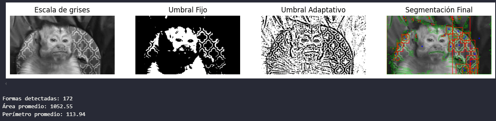

# 🧪 Taller - Segmentando el Mundo: Binarización y Reconocimiento de Formas

## 🗓️ Fecha

2025-05-03

---

## 🎯 Objetivo del Taller

Aplicar técnicas básicas de segmentación en imágenes mediante umbralización fija y adaptativa. Reconocer formas simples usando contornos, calcular sus propiedades geométricas y visualizarlas con OpenCV.

---

## 🧠 Conceptos Aprendidos

* Carga y conversión de imágenes a escala de grises.
* Segmentación mediante:

  * Umbral fijo (`cv2.threshold`)
  * Umbral adaptativo (`cv2.adaptiveThreshold`)
* Detección de contornos con `cv2.findContours`.
* Cálculo de centroide (`cv2.moments`) y bounding boxes (`cv2.boundingRect`).
* Visualización de resultados con Matplotlib.
* Captura de vídeo en tiempo real desde webcam.

---

## 🔧 Herramientas y Entornos

* Python (Jupyter Notebook o Google Colab)
* OpenCV
* NumPy
* Matplotlib

---

## 📁 Estructura del Proyecto

```
2025-05-03_taller_segmentacion_formas/
├── python/             # Implementación en python
├── resultados/         # Animaciones en formato gif e imagenes
├── datos/              # Imagen utilizada
├── README.md
```

---

## Implementación

### 📷 Carga y conversión de imagen a escala de grises

```python
imagen = cv2.imread(ruta, cv2.IMREAD_GRAYSCALE)
```

Se convierte a escala de grises para facilitar la segmentación.

### ⚖️ Segmentación: Umbral fijo y adaptativo

```python
_, fijo = cv2.threshold(imagen, 128, 255, cv2.THRESH_BINARY)
adapt = cv2.adaptiveThreshold(imagen, 255, cv2.ADAPTIVE_THRESH_MEAN_C, cv2.THRESH_BINARY, 11, 2)
```

* Umbral fijo: define un límite global.
* Umbral adaptativo: se adapta al vecindario local.

### 🔍 Detección de contornos y cálculo de propiedades

```python
contornos, _ = cv2.findContours(binaria, cv2.RETR_EXTERNAL, cv2.CHAIN_APPROX_SIMPLE)
areas = [cv2.contourArea(c) for c in contornos]
perimetros = [cv2.arcLength(c, True) for c in contornos]
```

Permite identificar y medir formas en la imagen binarizada.

### 🔍️ Visualización: contornos, centroides y bounding boxes

```python
cv2.drawContours(resultado, contornos, -1, (0, 255, 0), 1)
cv2.circle(resultado, (cx, cy), 4, (0, 0, 255), -1)
cv2.rectangle(resultado, (x, y), (x+w, y+h), (255, 0, 0), 2)
```

Colores:

* Verde: contornos
* Rojo: centroide
* Azul: caja delimitadora

### 📹 Mostrar resultados con Matplotlib

```python
mostrar_imagenes([(img_gris, "Escala de grises"), (umbral_fijo, "Umbral Fijo"), (umbral_adapt, "Umbral Adaptativo"), (resultado, "Segmentación Final")])
```

Permite comparar todas las etapas del proceso.

### 📻 Procesamiento en tiempo real con webcam

```python
cap = cv2.VideoCapture(0)
```

Aplicación de segmentación en vídeo en vivo.

---

## 📊 Resultados Visuales

* Imagen original, segmentada (umbral fijo y adaptativo) y resaltada (contornos, centros y cajas)



* Visualización webcam


---

## 🦀 Prompts Utilizados

* "Explícame cómo usar `cv2.adaptiveThreshold` y para qué sirve."
* "¿Cómo encuentro el centro de una figura con OpenCV?"
* "Genera código en Python para detectar formas usando contornos."

---

## 💬 Reflexión Final

Este taller permitió entender las bases del preprocesamiento de imágenes para detección de formas, aprendiendo a diferenciar entre umbrales globales y adaptativos. Fue importante visualizar el proceso paso a paso, desde la imagen original hasta los contornos detectados. El reto principal fue ajustar correctamente los parámetros del umbral adaptativo para obtener resultados limpios. La extensión a vídeo en tiempo real mostró el potencial de estas técnicas para aplicaciones interactivas.

---
