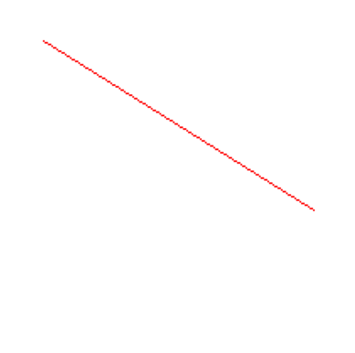
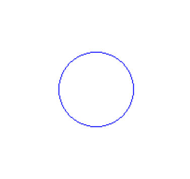
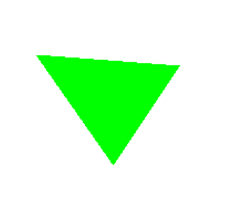

# 🧪 Taller - Rasterización desde Cero: Dibujando con Algoritmos Clásicos

## 🗓️ Fecha

2025-05-04

---

## 🎯 Objetivo del Taller

Comprender e implementar los algoritmos clásicos de rasterización para líneas, círculos y triángulos, entendiendo cómo se construyen imágenes píxel a píxel en una pantalla sin usar librerías de alto nivel.

---

## 🧠 Conceptos Aprendidos

* Lógica de dibujo a bajo nivel directamente en un arreglo de píxeles.
* Implementación manual de algoritmos clásicos de rasterización:

  * Algoritmo de Bresenham para líneas
  * Algoritmo del punto medio para círculos
  * Relleno de triángulos mediante interpolación de bordes (scanlines)
* Representación gráfica en 2D usando Pillow y Matplotlib.

---

## 🔧 Herramientas y Entornos

* Python (Jupyter Notebook o Google Colab)
* Pillow (para crear y modificar imágenes)
* Matplotlib (para visualización de resultados)

---

## 📁 Estructura del Proyecto

```
2025-05-05_taller_rasterizacion_basica/
├── python      # Implementación de los algoritmos python
├── resultados  # Capturas generadas
```

---

##  Implementación

### 🔹 Algoritmo de Bresenham (Líneas)

Permite dibujar una línea recta eficiente entre dos puntos enteros sin usar operaciones de punto flotante.

```python
def bresenham(x0, y0, x1, y1):
    dx = abs(x1 - x0)
    dy = abs(y1 - y0)
    sx = 1 if x0 < x1 else -1
    sy = 1 if y0 < y1 else -1
    err = dx - dy

    while True:
        pixels[x0, y0] = (255, 0, 0)  # Dibuja el píxel en rojo
        if x0 == x1 and y0 == y1:
            break
        e2 = 2 * err
        if e2 > -dy:
            err -= dy
            x0 += sx
        if e2 < dx:
            err += dx
            y0 += sy
```

Este algoritmo evita cálculos costosos y traza la línea incrementando coordenadas enteras según el error acumulado entre el punto real y el punto entero más cercano.

---

### ⚪ Algoritmo del Punto Medio (Círculos)

Calcula puntos del contorno de un círculo usando simetría octagonal y decisiones binarias en lugar de funciones trigonométricas.

```python
def midpoint_circle(x0, y0, radius):
    x = radius
    y = 0
    p = 1 - radius

    while x >= y:
        # Dibuja los 8 octantes del círculo en azul
        for dx, dy in [(x, y), (y, x), (-x, y), (-y, x), (-x, -y), (-y, -x), (x, -y), (y, -x)]:
            if 0 <= x0 + dx < width and 0 <= y0 + dy < height:
                pixels[x0 + dx, y0 + dy] = (0, 0, 255)
        y += 1
        if p <= 0:
            p = p + 2*y + 1
        else:
            x -= 1
            p = p + 2*y - 2*x + 1
```

Aprovecha la simetría de los círculos para dibujar solo un octante y reflejar el resultado a los otros siete, lo que mejora mucho la eficiencia.

---

### △ Relleno de Triángulo por Interpolación

Rellena un triángulo ordenando los vértices por Y e interpolando valores de X para trazar horizontales entre bordes.

```python
def fill_triangle(p1, p2, p3):
    # Ordenar los vértices por coordenada Y (de arriba hacia abajo)
    pts = sorted([p1, p2, p3], key=lambda p: p[1])
    (x1, y1), (x2, y2), (x3, y3) = pts

    def interpolate(y0, y1, x0, x1):
        # Interpola coordenadas X entre dos puntos en Y
        if y1 - y0 == 0: return []
        return [int(x0 + (x1 - x0) * (y - y0) / (y1 - y0)) for y in range(y0, y1)]

    # Calcular bordes interpolados del triángulo
    x12 = interpolate(y1, y2, x1, x2)
    x23 = interpolate(y2, y3, x2, x3)
    x13 = interpolate(y1, y3, x1, x3)

    x_left = x12 + x23  # Lado izquierdo
    for y, xl, xr in zip(range(y1, y3), x13, x_left):
        for x in range(min(xl, xr), max(xl, xr)):
            if 0 <= x < width and 0 <= y < height:
                pixels[x, y] = (0, 255, 0)  # Pinta el píxel en verde
```

La clave está en dividir los bordes en listas de coordenadas X por fila, y luego trazar franjas horizontales entre los extremos izquierdo y derecho de cada fila.

---

## 📊 Resultados Visuales

* Línea roja generada por el algoritmo de Bresenham.



* Círculo azul generado con punto medio.



* Triángulo verde relleno usando interpolación.



---

## 🧰 Prompts Utilizados

```text
- "Explícame cómo funciona el algoritmo de Bresenham paso a paso."
- "Explícame cómo funciona el algoritmo de Punto Medio paso a paso."
- "Explícame cómo funciona el algoritmo de Relleno de Triángulo por Interpolación paso a paso."
```

---

## 💬 Reflexión Final

Este taller me permitió comprender los fundamentos de la rasterización, observando la utilidad de los algoritmos clásicos que hacen posible el renderizado 2D a bajo nivel. Bresenham destaca por su precisión y velocidad al trazar líneas sin errores visuales, mientras que el algoritmo del punto medio para círculos aprovecha la simetría y reduce el cálculo al mínimo necesario. El relleno de triángulos, aunque conceptualmente más complejo, ofrece una introducción ideal a las técnicas de interpolación. En conjunto, estos tres métodos consolidan una base muy sólida para entender cómo funcionan los motores de renderizado para talleres o implementaciones futuras.
