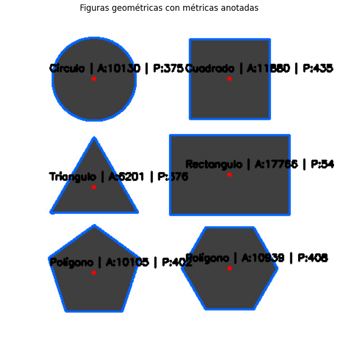

# 🧪 Taller - Análisis de Figuras Geométricas: Centroide, Área y Perímetro

## 🗓️ Fecha

2025-05-04

---

## 🎯 Objetivo del Taller

Detectar formas simples (como círculos, cuadrados, triángulos) en una imagen binarizada y calcular propiedades geométricas como área, perímetro y centroide. El enfoque se centra en aprender a extraer información cuantitativa a partir de contornos detectados.

---

## 🧠 Conceptos Aprendidos

* Binarización de imágenes con Otsu para facilitar el análisis de contornos.
* Uso de `cv2.findContours()` para detectar formas en imágenes binarizadas.
* Cálculo de:

  * Área usando `cv2.contourArea()`
  * Perímetro con `cv2.arcLength()`
  * Centroide con `cv2.moments()`
* Clasificación de formas geométricas con `cv2.approxPolyDP()`
* Anotación visual de métricas directamente sobre las figuras.

---

## 🔧 Herramientas y Entornos

* Python (Google Colab o Jupyter Notebook)
* Librerías: `opencv-python`, `numpy`, `matplotlib`

---

## 📁 Estructura del Proyecto

```
2025-05-04_taller_analisis_figuras_geometricas/
├── python/             # Implementación en python
├── resultados/         # Capturas resultantes
├── datos/              # Imagen utilizada
├── README.md
```

---

## Implementación

### 📂 Carga y Binarización de la Imagen

```python
imagen = cv2.imread(path, cv2.IMREAD_GRAYSCALE)
binaria = cv2.threshold(imagen, 0, 255, cv2.THRESH_BINARY_INV + cv2.THRESH_OTSU)[1]
```

Se invierte la imagen para que las figuras sean blancas sobre fondo negro, lo cual mejora la detección de contornos.

---

### ✏️ Cálculo de Métricas Geométricas

```python
def calcular_metrica_basica(contorno):
    area = cv2.contourArea(contorno)
    perimetro = cv2.arcLength(contorno, True)
    m = cv2.moments(contorno)
    cx = int(m["m10"] / m["m00"])
    cy = int(m["m01"] / m["m00"])
    return area, perimetro, (cx, cy)
```

Los momentos permiten obtener el centroide, mientras que el área y el perímetro se extraen directamente de los contornos.

---

### 🔹 Clasificación de Formas

```python
def clasificar_forma(contorno):
    approx = cv2.approxPolyDP(contorno, 0.03 * cv2.arcLength(contorno, True), True)
    if len(approx) == 3:
        return 'Triangulo'
    elif len(approx) == 4:
        aspecto = w / float(h)
        return 'Cuadrado' if 0.95 < aspecto < 1.05 else 'Rectangulo'
    elif len(approx) >= 8:
        return 'Circulo'
    return 'Poligono'
```

Según el número de vértices aproximados, se infiere la forma geométrica.

---

### 📝 Anotación sobre la Imagen

```python
cv2.drawContours(imagen_dibujo, [contorno], -1, (255, 100, 0), 2)
cv2.putText(imagen_dibujo, texto, (cx - 60, cy - 10), ...)
cv2.circle(imagen_dibujo, (cx, cy), 3, (0, 0, 255), -1)
```

Cada figura se dibuja con su contorno, nombre, área, perímetro y centroide marcado con un punto rojo.

---

## 📊 Resultados Visuales

* Contornos detectados y anotaciones:



* Figuras clasificadas correctamente: Triángulo, Cuadrado, Círculo.

---

## 🧰 Prompts Utilizados

```text
- "¿Cómo calcular el centroide de una figura usando cv2.moments()?"
- "¿Cuál es el mejor método para clasificar formas según sus lados en OpenCV?"
- "Explica paso a paso cómo binarizar una imagen para detectar figuras."
- "¿Para qué sirve approxPolyDP en la detección de formas?"
```

---

## 💬 Reflexión Final

Este taller me ayudó a comprender cómo extraer información estructural y cuantitativa de formas visuales. Aprendí la importancia de la binarización correcta, así como el papel central de los contornos y los momentos en el análisis geométrico. La parte de clasificación fue desafiante debido a figuras ambiguas o deformes, lo cual invita a considerar técnicas más robustas para etapas futuras.
