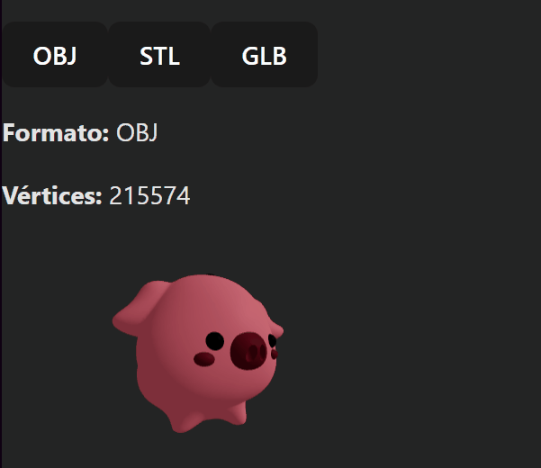

# 🧪 Taller - Importando el Mundo: Visualización y Conversión de Formatos 3D

## 🗓️ Fecha

2025-05-07

---

## 🎯 Objetivo del Taller

Comparar y convertir entre distintos formatos de modelos 3D: `.OBJ`, `.STL` y `.GLB`, y visualizar sus diferencias en geometría y materiales. El objetivo es entender la estructura interna de los archivos 3D, su compatibilidad entre entornos, y cómo se interpretan en distintas plataformas de visualización.

---

## 🧠 Conceptos Aprendidos

* Estructura interna de formatos `.OBJ`, `.STL`, `.GLB`.
* Conversión entre formatos con `trimesh` y `assimp`.
* Cálculo de propiedades geométricas: número de vértices, caras, volumen, duplicados.
* Visualización en 3D interactiva en Python con `plotly` y en la web con Three.js.
* Exportación y comparación masiva de modelos 3D desde una carpeta.

---

## 🔧 Herramientas y Entornos

* Python (Jupyter Notebook o Google Colab)

  * Librerías: `trimesh`, `open3d`, `numpy`, `plotly`
* React + Three.js (con React Three Fiber)
  * drei, GLTFLoader, OBJLoader, STLLoader

---

## 📁 Estructura del Proyecto

```
2025-05-08_taller_conversion_3d/
├── python/                  # Código de procesamiento y conversión
├── resultados/              # GIFs y modelos exportados
├── datos/                   # Modelos originales en distintos formatos
├── threejs/                 # Aplicación web para visualización
├── README.md
```

---

## 📊 Análisis y Visualización en Python

### 🔢 Clase `Modelo3D` y funciones clave

```python
class Modelo3D:
    def __init__(self, ruta):
        self.malla = trimesh.load(ruta)

    def info_basica(self):
        return dict(
            vertices=len(self.malla.vertices),
            caras=len(self.malla.faces),
            cerrado=self.malla.is_watertight
        )

    def exportar(self, carpeta, formatos=('obj', 'stl', 'glb')):
        for fmt in formatos:
            self.malla.export(os.path.join(carpeta, f"modelo.{fmt}"))

    def mostrar(self):
        # Visualización con Plotly
```

Permite cargar, analizar, exportar y visualizar un modelo 3D desde archivo.

### 🛋️ Clase `AnalizadorLote`

```python
class AnalizadorLote:
    def __init__(self, carpeta):
        self.modelos = [...]

    def mostrar_resumen(self):
        # Tabla con vertices, caras, volumen, duplicados

    def exportar_todos(self):
        # Convierte todos los modelos
```

Ideal para comparar varios modelos de una carpeta y automatizar su exportación.

---

## 📈 Resultados Visuales

* Generación y comparativa de modelos:


* Tabla de propiedades geométricas:

```
Nombre               | Verts  | Caras  | Dup  | Cerrado  | Volumen   
---------------------------------------------------------------------
piggyGLB.glb         | 37720  | 71858  | 1773 | No       | N/A       
piggyOBJ.obj         | 36818  | 71858  | 871  | No       | N/A       
piggySTL.stl         | 35947  | 71858  | 0    | Sí       | 0.70     
```

---

## 🌐 Visualización Web en Three.js

### 🔢 Componente `App`

```jsx
const [selected, setSelected] = useState('obj');
<Canvas>
  <ModelDisplay format={selected} />
</Canvas>
```

Selector de formato 3D y renderizado con React Three Fiber.

### 🛠️ Componente `ModelDisplay`

```jsx
const obj = useLoader(OBJLoader, '/model.obj');
const stl = useLoader(STLLoader, '/model.stl');
const gltf = useLoader(GLTFLoader, '/model.glb');

<primitive object={obj} />
```

Carga los tres formatos y permite alternar entre ellos. Usa OrbitControls y muestra información del modelo.

### 🎨 Ejemplo de Visualización



---

## 🤝 Prompts Utilizados

* "¿Cómo exporto un modelo de `trimesh` a `.glb` o `.obj`?"
* "Dame un resumen geométrico de un mesh: vértices, caras, volumen, cerrado."
* "¿Cómo puedo visualizar un STL con Three.js sin perder materiales?"
* "Genera un comparador de modelos en una carpeta usando `trimesh`."
* "Explica la diferencia entre `Scene` y `Mesh` en `trimesh.load`."

---

## 💬 Reflexión Final

Este taller permitió experimentar de forma concreta con los diferentes formatos 3D y observar diferencias no solo en estructura de archivo, sino también en renderizado final. Fue especialmente útil automatizar el análisis y conversión de modelos con `AnalizadorLote`, lo que facilita flujos de trabajo más eficientes. La parte web mostró cómo un mismo modelo puede comportarse distinto según el formato al cargarse en un navegador.

---
