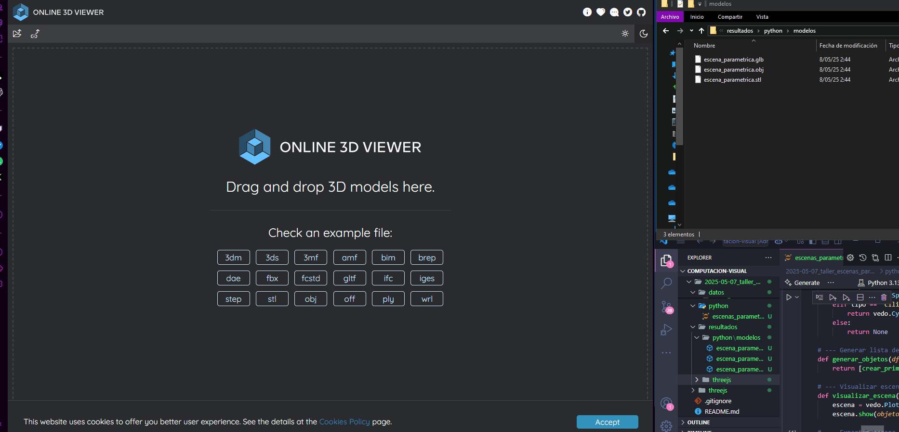
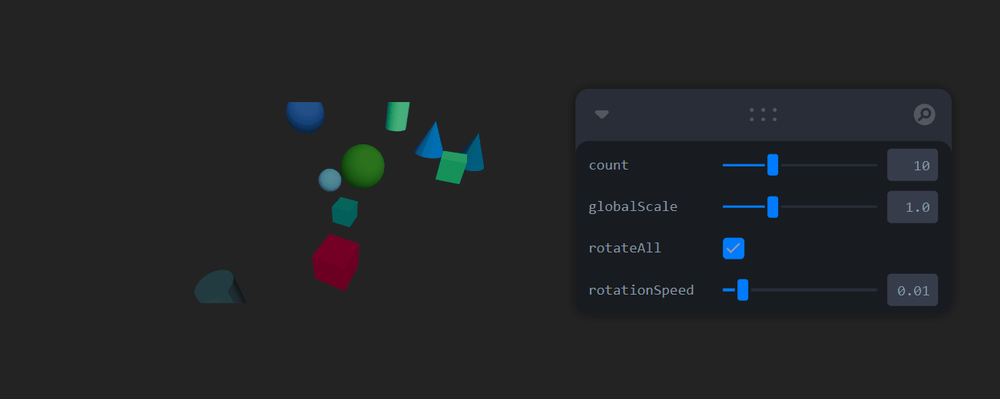

# 🧪 Taller - Escenas Paramétricas: Creación de Objetos desde Datos

## 🗓️ Fecha

2025-05-07

---

## 🎯 Objetivo del Taller

Generar objetos 3D de manera programada a partir de listas de coordenadas o datos estructurados, usando bucles y condicionales para parametrizar forma, color y escala. Aprender a exportar escenas completas en formatos estándar.

---

## 🧠 Conceptos Aprendidos

* Lectura de datos desde archivos CSV.
* Generación de primitivas 3D condicionales (cubo, esfera, cilindro).
* Exportación a formatos `.OBJ`, `.STL`, `.GLTF`.
* Parametrización de escenas en tiempo real con React Three Fiber y `leva`.

---

## 🔧 Herramientas y Entornos

* Python (Jupyter Notebook / Google Colab): vedo, numpy, pandas, open3d, trimesh
* React + Three.js (con React Three Fiber y Leva)

---

## 📁 Estructura del Proyecto

```
2025-05-08_taller_escenas_parametricas/
├── python/             # Scripts de generación 3D
├── resultados/         # GIFs e imágenes de las escenas
├── datos/              # Archivo datos_escena.csv
├── threejs/            # Proyecto con React Three Fiber
├── README.md
```

---

## 💡 Implementación Python

### 📂 Carga de Datos desde CSV

```python
ruta_csv = "../datos/datos_escena.csv"
datos = pd.read_csv(ruta_csv)
```

Carga datos con columnas: `x`, `y`, `z`, `tipo`, `escala`, `color`.

### 🔹 Creación de Primitivas Condicionales

```python
def crear_primitiva(fila):
    x, y, z = fila['x'], fila['y'], fila['z']
    tipo = fila['tipo'].lower()
    escala = fila['escala']
    color = fila['color']

    if tipo == 'cubo':
        return vedo.Cube(pos=(x, y, z), side=escala, c=color)
    elif tipo == 'esfera':
        return vedo.Sphere(pos=(x, y, z), r=escala, c=color)
    elif tipo == 'cilindro':
        return vedo.Cylinder(pos=(x, y, z), r=escala/2, height=escala*1.5, c=color)
```

Cada fila define una geometría según tipo.

### ✨ Generación de Escena y Visualización

```python
objetos = [crear_primitiva(f) for _, f in datos.iterrows() if crear_primitiva(f)]
vedo.Plotter(title="Escena Paramétrica 3D").show(objetos, interactive=True)
```

Itera por el DataFrame y genera la escena con `vedo`.

### 🔍 Exportación a .OBJ, .STL, .GLB

```python
vedo.write(mesh_vedo, "escena.obj")
vedo.write(mesh_vedo, "escena.stl")
o3d.io.write_triangle_mesh("escena.glb", malla_o3d)
```

Permite compartir las escenas en formatos estándar para otros programas 3D.

---

## 📊 Implementación Three.js (React Three Fiber)

### 📂 Mapeo de Objetos desde Datos

```jsx
const objects = Array.from({ length: count }).map((_, i) => ({
  id: i,
  type: types[i % types.length],
  position: randomPosition(),
  color: randomColor()
}))
```

Crea un array con objetos 3D que varían en tipo, posición y color.

### 🚀 Interactividad con Leva

```jsx
const { count, globalScale, rotateAll, rotationSpeed } = useControls({...})
```

Controla número de objetos, escala global y rotación desde la interfaz.

### 🌟 Renderizado Adaptativo

```jsx
{objects.map(obj => (
  <mesh position={obj.position} scale={[globalScale, globalScale, globalScale]}>
    {obj.type === 'box' && <boxGeometry />}
    {obj.type === 'sphere' && <sphereGeometry />}
    {obj.type === 'cone' && <coneGeometry />}
    <meshStandardMaterial color={obj.color} />
  </mesh>
))}
```

Cada objeto se representa con su tipo y color correspondiente.

---

## 📈 Resultados Visuales

* Escena renderizada desde datos CSV:



* Vista desde navegador con React:



---

## 🔎 Prompts Utilizados

* "¿Cómo exporto una malla de vedo a glTF usando open3d?"
* "Dame un ejemplo de condicional para crear primitivas distintas con vedo."
* "Genera geometrías 3D desde pandas"
* "React Three Fiber: crear múltiples objetos con datos aleatorios."
* "Controlar rotación de un grupo en React Three Fiber con useFrame."

---

## 💬 Reflexión Final

Este taller fue clave para entender la generación de geometría basada en datos. Aprendia interpretar tablas como estructuras 3D y a controlar escena y exportación de forma programática. El principal reto fue garantizar la exportación limpia a GLTF desde vedo, que requiere adaptación con Open3D. El uso de Three.js permitió llevar esa lógica al navegador, con interactividad inmediata gracias a Leva.

---
