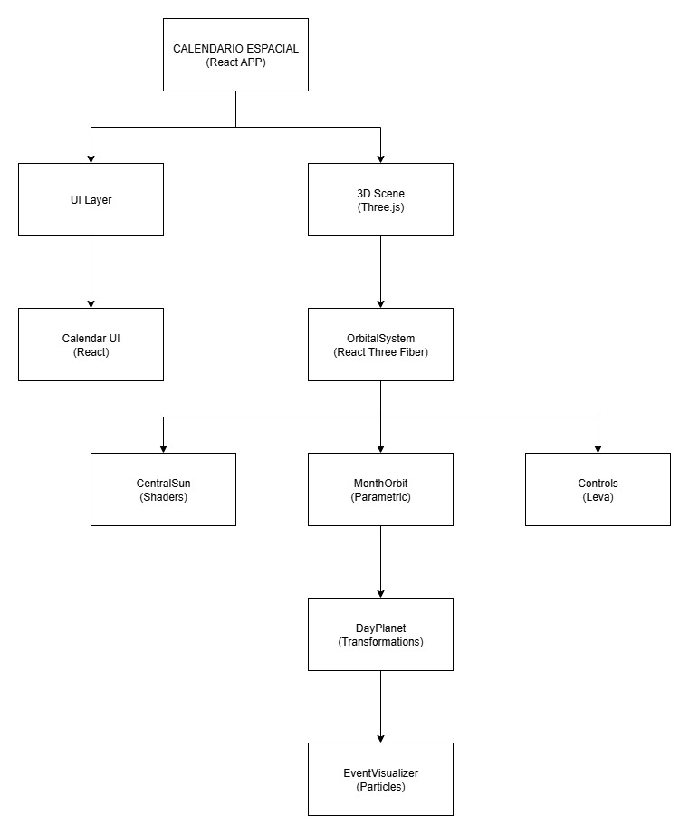

# 🪐 Calendario Espacial Interactivo - Informe Final

## Datos del Estudiante
- **Nombre completo:** Cristian Javier Medina Barrios
- **Número de documento:** 1034277642
- **Correo institucional:** crmedinab@unal.edu.co

---

## 📌 Introducción del Problema y Contexto

### Problema a Resolver
Seamos honestos, los calendarios que usamos todos los días son... un poco aburridos. Son cuadrículas planas, estáticas y funcionales, pero rara vez nos inspiran o nos ayudan a sentir el paso del tiempo de una manera más conectada. La información está ahí, sí, pero la experiencia de consultarla es monótona y carece de atractivo visual.

### Contexto de la Computación Visual
Este proyecto nació de una pregunta simple: **¿Y si consultar una fecha fuera una experiencia emocionante y visualmente atractiva?**

Aquí es donde la computación visual entra en juego. En lugar de limitarnos a dos dimensiones, podemos usar el poder del 3D para:
- **Crear metáforas espaciales:** Transformar un concepto abstracto como el "tiempo" en algo que podemos explorar con nuestros propios ojos, como un sistema solar.
- **Fomentar la interactividad:** Permitir que el usuario no sea un simple espectador, sino un explorador que puede rotar, hacer zoom y "viajar" a través del año.
- **Contar una historia con datos:** Usar colores, luces y efectos especiales para que los eventos importantes no solo se lean, sino que también se *sientan* diferentes.

El objetivo es crear una interfaz que no solo sea útil, sino también memorable y divertida de usar.

---

## 🎯 Justificación de la Solución

### Relevancia desde la Computación Visual
En lugar de inventar algo completamente nuevo y complejo, decidi usar una metáfora que casi todo el mundo conoce y entiende: **¡un sistema solar! 🪐**

Esta idea, aunque simple, es increíblemente poderosa desde el punto de vista de la computación visual:

1.  **Mapeo intuitivo:** El Sol en el centro, las órbitas para los meses y los planetas para los días. Es una jerarquía visual que no necesita explicación. La gente lo podría entender al instante.
2.  **Interacción natural:** Navegar por el tiempo se siente tan natural como explorar el espacio. El usuario ya sabe instintivamente cómo rotar o acercarse a un planeta que le interesa.
3.  **Jerarquía con estilo:** Uso el tamaño, el color y los efectos de partículas para dar pistas visuales. Los días con eventos importantes literalmente "brillan" más que los demás, guiando la atención del usuario de forma orgánica.
4.  **Feedback divertido:** Cada clic tiene una recompensa visual inmediata. La cámara se mueve suavemente, los efectos de partículas se intensifican... La aplicación se siente viva y receptiva.

### Ventajas de la Aproximación Orbital
- **Es fácil de entender:** No hay que aprender a usarlo. El modelo del sistema solar es universal.
- **No se siente abarrotado:** Aunque hay 365 días, el espacio 3D nos da mucho sitio para colocarlo todo sin que se vea desordenado.
- **Exploración fluida:** "Viajar" de enero a diciembre es tan simple como girar la vista.
- **¡Es increible!:** Seamos sinceros, un calendario que parece un sistema solar es mucho más memorable y divertido que una simple tabla.

---

## 🧠 Talleres Utilizados y su Integración

### 1. 🔄 Transformaciones Básicas (Taller 2025-04-15)
**Uso en el proyecto:**
- Implementación de rotaciones orbitales para cada mes
- Transformaciones de escala para diferentes tipos de días
- Movimiento circular de planetas-día alrededor de sus órbitas

**Técnicas aplicadas:**
```javascript
// Rotación orbital de meses
useFrame((state) => {
  if (groupRef.current) {
    groupRef.current.rotation.y += systemSpeed * 0.001
  }
})

// Transformaciones de escala para días
const scaleMultiplier = 1.2 + 0.1 * Math.sin(state.clock.elapsedTime * 5)
meshRef.current.scale.setScalar(scale * scaleMultiplier)
```

### 2. 🎨 Shaders Básicos (Taller 2025-05-24)
**Uso en el proyecto:**
- Shader personalizado para el sol central con efectos de pulso y ruido
- Materiales especiales para días con eventos (emisión de luz)
- Efectos de brillo y gradientes dinámicos

**Técnicas aplicadas:**
```glsl
// Fragment shader para el sol central
float noise = sin(vUv.x * 10.0 + uTime * 2.0) * 
             sin(vUv.y * 10.0 + uTime * 1.5) * 0.5 + 0.5;
float pulse = 0.8 + 0.2 * sin(uTime * uPulseSpeed);
vec3 color = mix(uColor1, uColor2, noise * radialGradient);
```

### 3. 🌍 Escenas Paramétricas (Taller 2025-05-07)
**Uso en el proyecto:**
- Generación procedural de órbitas con diferentes radios
- Creación automática de 365 días como objetos 3D
- Distribución paramétrica de eventos en el calendario

**Técnicas aplicadas:**
```javascript
// Generación procedural de días
const dayPositions = useMemo(() => {
  const positions = []
  for (let day = 1; day <= month.days; day++) {
    const angle = (day / month.days) * Math.PI * 2
    const x = Math.cos(angle) * radius
    const z = Math.sin(angle) * radius
    const y = Math.sin(angle * 3) * 2 // Variación en altura
    positions.push({ day, position: [x, y, z], angle })
  }
  return positions
}, [month.days, month.radius])
```

### 4. 💫 Colisiones y Partículas (Taller 2025-05-26)
**Uso en el proyecto:**
- Sistemas de partículas para eventos especiales
- Diferentes patrones de partículas (sparkle, orbit, wave, explosion)
- Efectos visuales reactivos al interactuar con días

**Técnicas aplicadas:**
```javascript
// Sistema de partículas para eventos
const particleConfig = {
  special: { count: 50, color: '#ff6b9d', pattern: 'sparkle' },
  season: { count: 30, color: '#4ecdc4', pattern: 'orbit' },
  space: { count: 60, color: '#f39c12', pattern: 'explosion' }
}
```

### 5. 🎛️ Dashboards Visuales 3D (Taller 2025-06-24)
**Uso en el proyecto:**
- Panel de control interactivo y estilizado con Leva para personalizar la experiencia.
- Controles organizados en carpetas para "Apariencia", "Órbitas" y "Filtros".
- El diseño del panel fue personalizado para integrarse con la estética de la aplicación.
- Interfaz lateral colapsable para maximizar el espacio de visualización.

**Técnicas aplicadas:**
```javascript
// Controles interactivos con Leva, organizados en carpetas
const { 
  'Velocidad de Rotación': systemSpeed,
  // ...etc
} = useControls('Configuración Visual', {
  'Apariencia General': folder({
    'Escala General': { value: 1, min: 0.5, max: 2 },
    'Tamaño de Planetas': { value: 1.2, min: 0.5, max: 2.5 },
  }),
  'Órbitas y Planetas': folder({
    'Velocidad de Rotación': { value: 0.8, min: 0, max: 3 },
    'Mostrar Órbitas': { value: true },
    'Números en Días': { value: true },
  }),
  'Filtros': folder({
    'Filtrar por Mes': { 
      value: 'Todos', 
      options: ['Todos', ...Object.values(MONTHS_INFO).map(m => m.name)] 
    },
  })
})
```

### 6. 🎬 Interpolación y Animaciones (Taller 2025-06-24)
**Uso en el proyecto:**
- Animaciones suaves de cámara entre diferentes vistas
- Interpolación de movimientos orbitales
- Transiciones fluidas entre estados de interfaz

**Técnicas aplicadas:**
```javascript
// Interpolación suave de cámara
camera.position.lerp(targetPosition.current, animationSpeed * 0.01)
currentLookAt.current.lerp(targetLookAt.current, animationSpeed * 0.01)
```

### 7. 🎨 Materiales PBR (Taller 2025-05-31)
**Uso en el proyecto:**
- Materiales realistas para diferentes tipos de días
- Iluminación física correcta con point lights y directional lights
- Efectos de emisión para días especiales

**Técnicas aplicadas:**
```javascript
// Materiales PBR para días normales
const standardMaterial = new THREE.MeshStandardMaterial({
  color: dayConfig.color,
  metalness: 0.2,
  roughness: 0.7
})

// Material especial para eventos
const eventMaterial = new THREE.MeshPhongMaterial({
  color: dayConfig.color,
  emissive: new THREE.Color(dayConfig.color).multiplyScalar(0.3),
  shininess: 100
})
```

---

## 🏗️ Diagrama de Arquitectura



### Relación entre Módulos
Para que el sistema funcione, los módulos se comunican siguiendo un flujo de datos y control muy claro, asegurando que cada componente tenga una responsabilidad única y definida.

1.  **El Origen de los Datos (`eventsData.js`):** Este archivo es el punto de partida y la única fuente de verdad para toda la información del calendario. Define la estructura de los meses, los días festivos, y lo más importante, la configuración visual de cada tipo de evento (sus colores, patrones de partículas, etc.).

2.  **El Organizador Central (`OrbitalSystem`):** Este es el componente principal de la escena 3D. Su primera tarea es leer toda la información de `eventsData.js`. Luego, actúa como un organizador: recorre los datos de los meses y, para cada uno, renderiza un componente `MonthOrbit`. A su vez, le pasa a este los datos de los días correspondientes.

3.  **Los Constructores Visuales (`MonthOrbit` y `DayPlanet`):** `MonthOrbit` recibe los datos de un mes y se encarga de dibujar su órbita y el texto con su nombre. Dentro de él, recorre los días de ese mes y renderiza un componente `DayPlanet` para cada uno, pasándole la información específica de ese día.

4.  **El Especialista en Efectos (`EventVisualizer`):** El componente `DayPlanet` comprueba si el día que representa tiene un evento. Si es así, renderiza el componente `EventVisualizer`. Este es un módulo altamente especializado: su único trabajo es crear los sistemas de partículas, halos y demás efectos visuales, basándose en las propiedades del evento que le pasa el `DayPlanet`.

5.  **La Capa de Interacción (`CalendarUI`, `Leva`, `CameraController`):** Estos componentes gestionan la interacción del usuario. `CalendarUI` muestra la información en el panel 2D y contiene el formulario para crear nuevos eventos. `Leva` ofrece los controles para manipular la escena. Cuando el usuario realiza una acción (como hacer clic en un día o añadir un evento), estos componentes actualizan el estado central de la aplicación. Este cambio de estado provoca que la escena 3D se vuelva a renderizar con la nueva información, y el `CameraController` se encarga de mover la cámara suavemente hacia el objetivo seleccionado. Es un ciclo de "acción del usuario -> actualización de estado -> redibujado de la escena".

---

## 🖥️ Explicación Técnica del Funcionamiento

### Arquitectura del Sistema

#### 1. Inicialización de la Aplicación
```javascript
// App.jsx - Punto de entrada principal
<Canvas camera={{ position: [0, 50, 100], fov: 75 }}>
  <OrbitalSystem />
  <CameraController />
  <OrbitControls />
</Canvas>
```

#### 2. Sistema Orbital Jerárquico
- **Sol Central:** Utiliza shaders personalizados para efectos de pulso y ruido
- **Órbitas Mensuales:** Cada mes tiene su propia órbita con radio específico
- **Días como Planetas:** Cada día se representa como una esfera en su órbita mensual

#### 3. Generación Procedural
```javascript
// Algoritmo de distribución de días
for (let day = 1; day <= month.days; day++) {
  const angle = (day / month.days) * Math.PI * 2
  const position = {
    x: Math.cos(angle) * radius,
    y: Math.sin(angle * 3) * 2, // Variación en altura
    z: Math.sin(angle) * radius
  }
}
```

#### 4. Sistema de Eventos
- **Detección:** Cada día verifica si tiene eventos asociados
- **Visualización:** Eventos activan sistemas de partículas específicos
- **Interacción:** Click en días muestra información del evento

#### 5. Creación de Eventos Personalizados
- **Interfaz de Creación:** Se añadio un formulario en el panel lateral que permite al usuario crear eventos personalizados, definiendo fecha, nombre, descripción y color.
- **Estado Dinámico:** Los eventos no son estáticos. La aplicación utiliza un estado de React que se inicializa con los eventos de 2025 y se actualiza dinámicamente cada vez que un usuario añade un nuevo evento.
- **Visualización Instantánea:** Los nuevos eventos se reflejan inmediatamente en la visualización 3D, apareciendo en la órbita correspondiente con un estilo visual "personalizado" predefinido.

#### 6. Controles Interactivos
```javascript
// Leva Controls para personalización
const controls = useControls('Sistema Orbital', {
  systemSpeed: { value: 1, min: 0, max: 5 },
  showOrbits: { value: true },
  dayScale: { value: 1, min: 0.5, max: 3 }
})
```
---

## 📸 Evidencia de Funcionamiento

### Vista General del Sistema


**Descripción:** Muestra el sistema solar completo con 12 órbitas mensuales, cada una con sus días correspondientes. Se pueden ver las diferentes escalas y colores de cada mes.

### Interacción con Eventos


**Descripción:** Demuestra la interacción con días que tienen eventos especiales, mostrando los sistemas de partículas y efectos visuales correspondientes.

### Controles de Navegación


**Descripción:** Muestra cómo los controles de Leva permiten personalizar la experiencia: cambio de velocidad, filtros de meses, y escalas.

### Cámara Cinematográfica


**Descripción:** Demuestra las diferentes vistas de cámara (general, seguimiento, cenital) y la interpolación suave entre ellas.

### Añadir nuevo evento y visualización


**Descripción:** Muestra el proceso completo para añadir un evento personalizado a través del panel lateral y cómo este aparece instantáneamente en la visualización 3D.

---

## 🎬 Video de Demostración

**Enlace al video:** [https://www.youtube.com/watch?v=u1tbXGNG19E]

**Duración:** 4:11 minutos

---

## 🔬 Conclusiones y Reflexiones Personales

### Logros Técnicos Alcanzados

1.  **Integración Exitosa:** Se logró combinar 7 talleres diferentes en una aplicación cohesiva que demuestra el dominio de múltiples técnicas de computación visual.

2.  **Complejidad Técnica:** El proyecto maneja exitosamente:
   - 365+ objetos 3D renderizados simultáneamente
   - Múltiples sistemas de partículas
   - Shaders personalizados
   - Animaciones fluidas
   - Interactividad en tiempo real

3.  **Experiencia de Usuario:** Se creó una interfaz intuitiva que combina:
   - Navegación 3D familiar
   - Controles accesibles
   - Retroalimentación visual clara
   - Información organizada jerárquicamente

### Desafíos Superados
No todo fue un paseo por el espacio. ¡Tuve algunos encuentros con agujeros negros y asteroides en el camino! 🕳️☄️

1.  **El Misterio de la Pantalla Negra:** Hubo un momento crítico en el desarrollo en que la aplicación simplemente se apagó. Mostraba una pantalla negra, sin dar ni un solo error en la consola. Fue frustrante. Después de investigar, deshabilitando componentes uno por uno, descubri que el culpable era un componente de texto 3D. Intentaba cargar una fuente desde una URL de Google Fonts que ya no existía. ¡Una sola línea de código, una dependencia externa rota, estaba colapsando todo nuestro universo! Fue una gran lección sobre la importancia de controlar cada recurso que se carga en una escena 3D.

2.  **Las Partículas Rebeldes:** Al principio, los efectos de partículas para los eventos se veían geniales, ¡pero tenían demasiadas ganas de explorar la galaxia! Se generaban y se dispersaban por toda la pantalla hasta desaparecer por completo. El problema era que su animación se calculaba sobre su propia posición anterior, creando un efecto de bola de nieve que las empujaba cada vez más lejos. La solución fue darles un "ancla": se guardo su posición inicial y se calculo siempre el movimiento con respecto a ese origen. Así se logro que se quedaran en un enjambre ordenado y bonito alrededor de su planeta.

### Aplicaciones Futuras

1.  **Extensiones Posibles:**
   - Integración con APIs de calendario reales
   - Soporte para múltiples años
   - Personalización de eventos por usuario
   - Exportación de visualizaciones

2.  **Casos de Uso:**
   - Herramientas educativas para enseñanza del tiempo
   - Aplicaciones corporativas para planificación
   - Interfaces de calendario innovadoras
   - Visualizaciones de datos temporales

### Reflexión Personal
Este proyecto ha sido mucho más que un simple examen. Ha sido un viaje increíble que me ha enseñado que la computación visual es el punto exacto donde la lógica y la creatividad chocan para crear algo maravilloso. La sensación de solucionar un problema complejo y ver el resultado cobrar vida en la pantalla es increíblemente gratificante.

El momento en que finalmente arreglé el error de la pantalla negra y vi el sistema solar aparecer por primera vez, o cuando las partículas finalmente danzaron como yo quería, fueron verdaderas revelaciones. Esos pequeños triunfos son los que hacen que la programación sea tan adictiva y divertida.

Este proyecto ha consolidado mi interes por crear experiencias interactivas y me ha dado un vistazo al futuro de las interfaces web, un futuro que es inmersivo, intuitivo y, sobre todo, mucho más humano. La computación visual no se trata solo de hacer cosas bonitas, sino de encontrar formas más efectivas y emocionantes de comunicarnos con la tecnología.

---